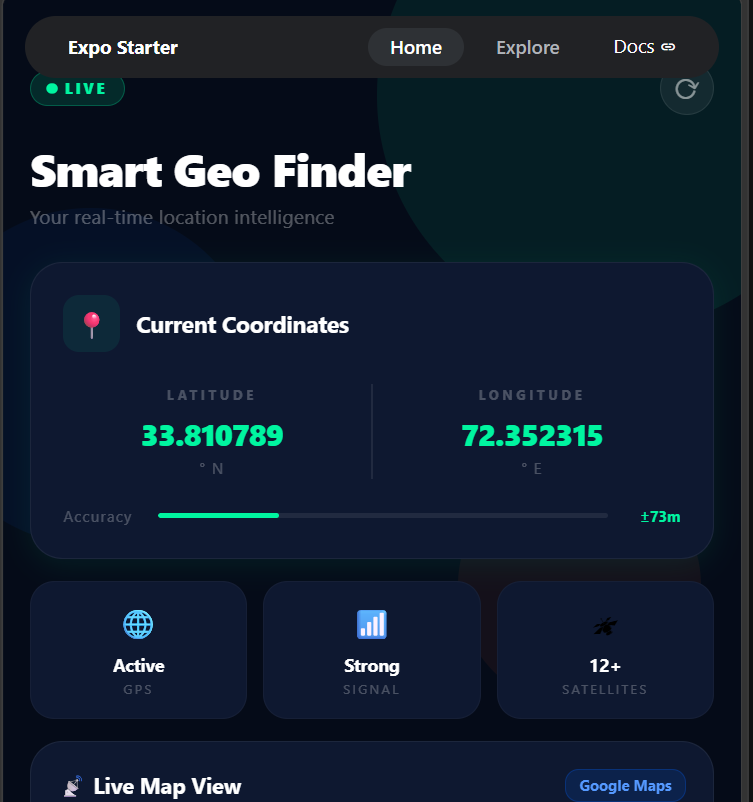
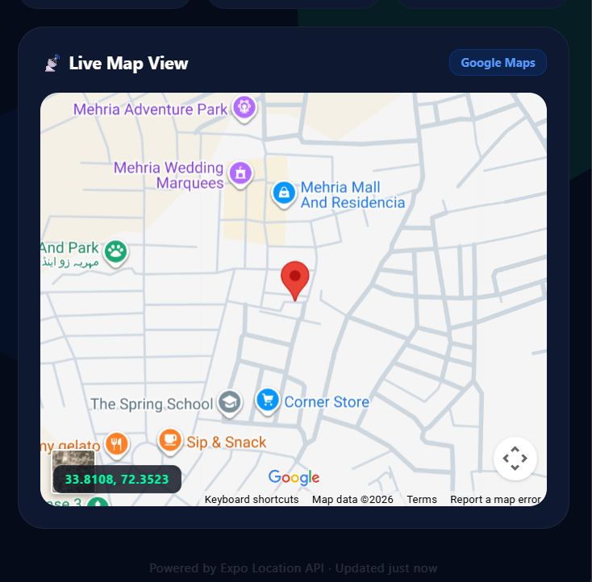
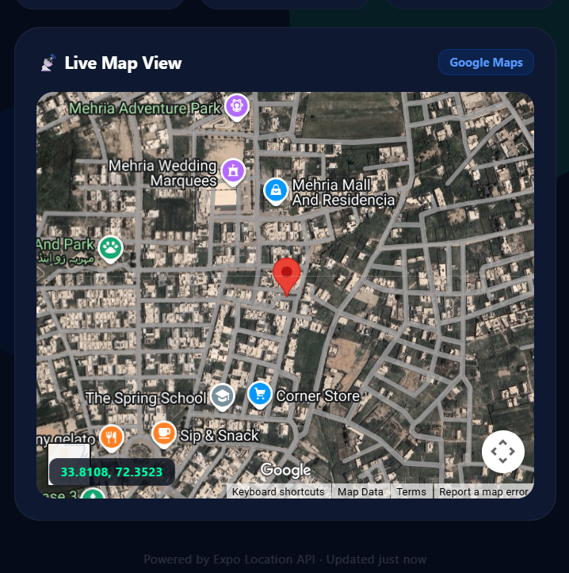
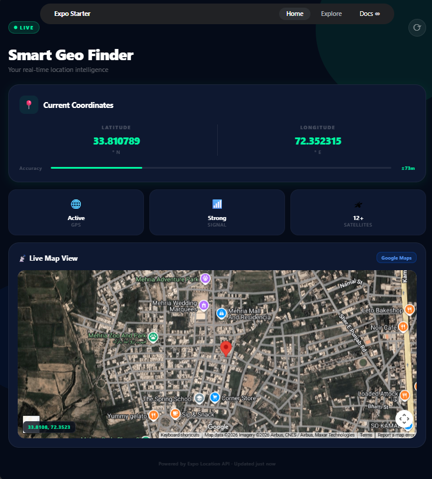

# 📍 Smart Geo Finder

<p align="center">


<h1 align="center">Smart Geo Finder</h1>

<p align="center">
Real-time location intelligence application built using React Native and Expo
</p>

<p align="center">


</p>

---

# 📖 About Project

Smart Geo Finder is a modern location-based application developed using **React Native + Expo**. The application obtains the user's real-time geographic coordinates and displays the current location on an interactive map.

The app provides:

- Current coordinates
- Real-time location detection
- Interactive map view
- Satellite map display
- GPS status
- Signal information
- Clean and modern UI

---

# ✨ Features

✅ Get current user location

✅ Display Latitude & Longitude

✅ Live map integration

✅ Real-time coordinates update

✅ GPS status display

✅ Signal status display

✅ Satellite information

✅ Interactive Google Map

✅ Modern UI/UX design

---

# 🛠 Technologies Used

| Technology | Purpose |
|------------|----------|
| React Native | Mobile Development |
| Expo | Development Framework |
| Expo Location | Location Access |
| TypeScript | Programming Language |
| Google Maps | Map Visualization |

---

# 📂 Project Structure

```bash
GeoFinder
│
├── app
│   └── index.tsx
│
├── assets
│   └── screenshots
│       ├── loading-screen.png
│       ├── dashboard-screen.png
│       ├── map-view.png
│       ├── satellite-view.png
│       └── full-app-view.png
│
├── package.json
├── app.json
└── README.md
```

---

# 🚀 Installation

### Clone Project

```bash
git clone your-repository-link
```

### Move into project

```bash
cd GeoFinder
```

### Install dependencies

```bash
npm install
```

### Install required packages

```bash
npx expo install expo-location react-native-maps
```

### Run project

```bash
npx expo start
```

---

# 📱 Application Workflow

```text
Start App
     ↓
Request Location Permission
     ↓
Allow Permission
     ↓
Fetch Coordinates
     ↓
Display GPS Information
     ↓
Load Interactive Map
     ↓
Show Current Location Marker
```

---

# 📷 Application Screenshots

## Loading Screen

<p align="center">

</p>

Displays animated loading screen while obtaining current location.

---

## Dashboard Screen

<p align="center">

</p>

Shows:

- Latitude
- Longitude
- GPS Status
- Signal Strength
- Satellite Count

---

## Live Map View

<p align="center">

</p>

Displays user's current position on the map.

---

## Satellite Map View

<p align="center">

</p>

Shows location using satellite mode.

---

## Complete Application View

<p align="center">

</p>

Full user interface of Smart Geo Finder.

---

# 🎯 Expected Output

```text
📍 Smart Geo Finder

Latitude : 33.810789

Longitude : 72.352315

GPS : Active

Signal : Strong

Satellites : 12+

Map : Current Location Displayed
```

---

# 🔮 Future Enhancements

- Nearby places search
- Route navigation
- Dark mode support
- Weather integration
- Favorite locations
- Live location sharing

---

# 👩‍💻 Developer

**Maryam Fatima**

Backend Developer | React Native Developer

---

# 📄 License

This project is created for educational and learning purposes.

---

<p align="center">
⭐ If you like this project, give it a star ⭐
</p>